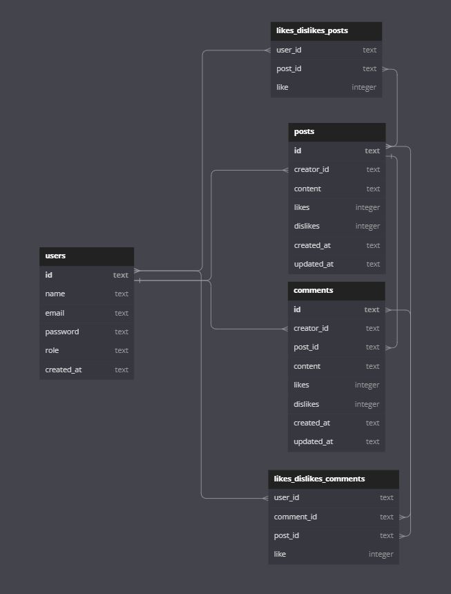

Labeddit FullStack - Backend 

Introdução

    O projero Labeddit é uma rede social desenvolvida com o intuito de conectar diferentes pessoas e fazer com que elas possam interagir entre si. Desta forma o Labeddit permite a criação de usuários, criação de posts e comentários, além de poder curtir/descurtir posts e comentários de outras pessoas.

Diagrama Banco de Dados

Tecnologias utilizadas

1. NodeJS
2. Typescript
3. Express
4. SQL e SQLite
5. Knex
6. Postman
7. POO
8. Arquitetura em camadas
9. Geração de UUID
10. Geração de hashes
11. Autenticação e autorização
12. Roteamento
13. Jest

Funcionabilidades do Projeto

- [x] Endpoints:

- signup;
- login;
- create post;
- get posts;
- edit post;
- delete post;
- like / dislike post;
- create comment;
- get comment;
- delete comment;
- like / dislike comment;
 

- [x] Autenticação e autorização:

-  identificação UUID;
- senhas hasheadas com Bcrypt;
- tokens JWT;
 

- [x] Código:

- POO;
- Arquitetura em camadas;
- Roteadores no Express.
 

Repositório Front-end
- gitHub: https://github.com/Alberto-Faria/Projeto_Labeddit_Fullstack_frontend

Documentação

- Postman: https://documenter.getpostman.com/view/26585579/2s9YRCVqak

Rodando o Projeto

- Abra o Vscode na pasta em que você baixou os arquivos;

- Insira npm install;

- Depois, npm run dev para rodar no navegador.

